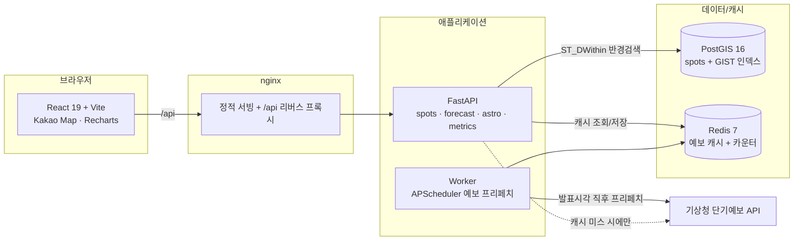

# StarSpot 🌌

> **오늘 밤, 내 위치에서 갈 만한 거리 안에 별이 가장 잘 보이는 곳은 어디인가?**

내 위치 반경 안의 관측 후보지를 지도에 띄우고, **오늘 밤 관측 점수(0~100)** 로 랭킹을 매겨 추천하는 서비스입니다. 광공해(VIIRS), 기상청 구름 예보, 달 방해도, 접근성을 조합해 점수를 계산합니다.

이 저장소는 **클라우드/인프라 포트폴리오**로, 컨테이너 구성 · CI/CD · 캐싱 전략 · 배치 파이프라인을 코드만큼 중요하게 다룹니다.

---

## 아키텍처



### 점수 공식

```
score = 0.40·darkness + 0.35·(100 − cloud) + 0.15·moon + 0.10·access
```

| 항목 | 정의 | 계산 |
|------|------|------|
| darkness | 광공해가 적을수록 높음 | VIIRS radiance를 `log10(r+0.1)` 압축 후 0~100 정규화·반전 |
| cloud | 전운량 | 기상청 SKY(1/3/4)→0/60/100, PTY≠0이면 100 강제 |
| moon | 달 방해도의 역수 | `100 − (달밝기 × 관측시간대 중 달이 지평선 위인 비율 × 100)` |
| access | 접근성 | `max(0, 100 − 거리km)` |

점수는 **일몰 후 1시간 ~ 일출 전 1시간** 구간을 1시간 단위로 계산하고, 그 구간 최댓값을 "오늘 밤 점수"로 씁니다. 시간대별 배열은 상세 화면 그래프에 사용됩니다.

---

## 기술 스택

| 레이어 | 스택 |
|--------|------|
| Frontend | React 19 · TypeScript · Vite 6 · TanStack Query · Recharts · Kakao Map JS SDK |
| Backend | Python 3.12 · FastAPI · Pydantic v2 · SQLAlchemy 2.0 · astronomy-engine |
| Batch | rasterio (VIIRS crop/추출 전용, 런타임 의존성 아님) |
| DB / Cache | PostgreSQL 16 + PostGIS 3.4 · Redis 7 |
| Infra | Docker Compose · GitHub Actions · Docker Hub (`kwsumin01`) · nginx |

---

## 실행법

### 1. 로컬 (빌드 포함)

```bash
cp .env.example .env
# .env 에 KMA_SERVICE_KEY, KAKAO_MAP_KEY 를 채워 넣으세요 (없어도 기동됩니다).

docker compose up --build
```

- 프론트엔드: <http://localhost:8080>
- API 헬스체크: <http://localhost:8080/api/v1/health>

기동 시 `api` 서비스가 자동으로 `alembic upgrade head → seed_spots → uvicorn` 순서로 실행됩니다.

### 2. 프로덕션 (푸시된 이미지 사용)

```bash
docker compose -f docker-compose.yml -f docker-compose.prod.yml up -d
```

### 환경변수

| 변수 | 설명 |
|------|------|
| `KMA_SERVICE_KEY` | 기상청 단기예보 API 키 (data.go.kr) |
| `KAKAO_MAP_KEY` | 카카오맵 JS SDK 키 (로컬/배포 도메인 분리 권장) |
| `DATABASE_URL` | PostgreSQL+PostGIS 연결 |
| `REDIS_URL` | Redis 연결 |

> 시크릿은 전부 환경변수로 외부화되어 있으며 `.env` 는 커밋되지 않습니다. VIIRS 원본 GeoTIFF도 커밋 대상이 아닙니다.

---

## 캐싱 전략과 효과

기상청 API 호출은 **반드시 Redis 캐시를 경유**합니다 (우회 경로 없음).

### 1) 격자 공유로 호출량 절감

서로 다른 후보지가 같은 기상청 격자를 공유합니다. `kma_nx/ny`를 시드 시점에 미리 계산해 저장하므로, 예보 조회는 **후보지 수가 아니라 고유 격자 수만큼만** 발생합니다.

| 후보지 수 | 고유 격자 수 | 순진한 호출 (후보지마다) | 격자 dedup 후 | 절감 |
|-----------|--------------|--------------------------|----------------|------|
| 30 (현재 시드) | **29** | 30 | 29 | ~3% |
| 300 (목표 확장) | ~120 (추정) | 300 | ~120 | **~60%** |

> 현재 30곳 시드는 전국에 넓게 분포해 격자 중복이 거의 없지만(30→29), 후보지를 조밀하게 확장할수록(300곳) 격자 공유 효과가 커집니다.

### 2) 프리페치 배치로 사용자 요청 = 항상 캐시 히트

`worker` 서비스가 발표 시각(02/05/08/11/14/17/20/23시) 직후 전체 고유 격자를 프리페치합니다. 따라서 **사용자 요청 시점에는 이미 캐시가 채워져 있어 외부 API 호출이 0** 입니다.

| 시나리오 | 사용자 요청당 외부 API 호출 |
|----------|------------------------------|
| 캐시 없음 | 요청마다 격자 수만큼 (예: 반경 내 29격자 → 29회) |
| 캐시 + 프리페치 | **0회** (배치가 미리 채움, TTL 3h) |

### 3) 장애 복원력 (stale fallback)

기상청 API가 다운되거나 키가 무효화돼도, 마지막 성공 예보를 별도 백업 키(TTL 24h)에 보관해 서비스가 계속 동작합니다. 이때 응답에 `stale: true` 플래그를 포함합니다.

### 캐시 메트릭 확인

```bash
curl http://localhost:8080/api/v1/metrics/cache
# {"hits":..,"misses":..,"stale_served":..,"total":..,"hit_rate_pct":..}
```

---

## API

| Method | Path | 설명 |
|--------|------|------|
| GET | `/api/v1/spots?lat&lon&radius_km&limit` | 반경 내 후보지 + 오늘 밤 점수 (점수 내림차순) |
| GET | `/api/v1/spots/{id}` | 후보지 상세 |
| GET | `/api/v1/spots/{id}/forecast?date` | 시간대별 점수 배열 + 구름/달 원자료 |
| GET | `/api/v1/astro?lat&lon&date` | 일출몰·월출몰·월령 |
| GET | `/api/v1/health` | liveness |
| GET | `/api/v1/metrics/cache` | 캐시 히트/미스 누적 |

---

## CI/CD

`.github/workflows/ci.yml` — GitHub Actions:

1. **backend** — ruff lint → alembic migrate (PostGIS/Redis 서비스 컨테이너) → pytest
2. **frontend** — eslint → `tsc` + vite build
3. **publish** (main push 시) — buildx로 백엔드/프론트 이미지를 Docker Hub(`kwsumin01`)에 push. 태그: `latest` + `sha-<short>`

> Docker Hub push 는 `DOCKERHUB_TOKEN` 레포지토리 시크릿이 필요합니다.

---

## 관측성 (Observability)

`prometheus-client` 로 애플리케이션 메트릭을 노출하고, 구조적 JSON 로그에 요청 추적 ID를 심습니다.

- `GET /metrics` — Prometheus 포맷
  - `starspot_http_requests_total{method,path,status}` (경로는 라우트 템플릿 → 카디널리티 안전)
  - `starspot_http_request_duration_seconds` (지연 히스토그램)
  - `starspot_cache_events_total{result=hit|miss|stale}`
  - `starspot_kma_requests_total{outcome=success|failure}`
- 모든 JSON 로그 라인에 `request_id` 포함 (`x-request-id` 헤더 전파, 없으면 자동 생성)

로컬에서 Prometheus + Grafana 띄우기:

```bash
docker compose -f docker-compose.yml -f docker-compose.monitoring.yml up -d
# Grafana: http://localhost:3000 (admin/admin) — "StarSpot Observability" 대시보드
# Prometheus: http://localhost:9090
```

Grafana 대시보드 패널: 캐시 히트율 · API 지연 p95 · 기상청 외부 API 실패율 · 요청량 · 캐시 이벤트.

## Kubernetes (선택 배포)

`infra/k8s/` 에 매니페스트가 있습니다 (kubeconform 검증 완료):

- `Namespace`, `ConfigMap`, `Secret`(템플릿)
- `StatefulSet`(postgis) + `Deployment`(redis)
- `Deployment`(api, initContainer로 migrate+seed) + `Deployment`(worker)
- `Deployment`(nginx) + `Service` × N + `Ingress`
- `CronJob`(kma-prefetch) — worker 대신 쓸 수 있는 k8s 네이티브 스케줄링

```bash
kubectl apply -f infra/k8s/
# 시크릿은 커밋하지 않으므로 실제 배포 시 별도 생성:
kubectl -n starspot create secret generic starspot-secret \
  --from-literal=POSTGRES_USER=starspot \
  --from-literal=POSTGRES_PASSWORD='***' \
  --from-literal=KMA_SERVICE_KEY='***' \
  --from-literal=KAKAO_MAP_KEY='***'
```

## 데이터 파이프라인 (배치)

`backend/scripts/` — 런타임과 분리된 배치 스크립트:

- `crop_viirs.py` — 전지구 VIIRS VNL GeoTIFF를 한반도 bbox로 crop (윈도우 읽기)
- `extract_radiance.py` — crop된 래스터에서 후보지별 radiance 샘플링 → `darkness_score`/`bortle` 산출
- `seed_spots.py` — PostGIS 적재 + `kma_nx/ny` 사전 계산

> VIIRS 원본은 수 GB이므로 커밋하지 않습니다. 다운로드 스크립트와 crop 결과만 관리합니다.

---

## 디렉터리 구조

```
starspot/
├── docker-compose.yml          # 5개 서비스 (nginx/api/worker/postgis/redis)
├── docker-compose.prod.yml     # 프로덕션 오버레이 (푸시 이미지)
├── .github/workflows/ci.yml    # lint → test → build → push
├── backend/                    # FastAPI + 서비스 + 배치 스크립트
├── frontend/                   # React + Vite + nginx
└── infra/nginx/default.conf    # 정적 서빙 + /api 프록시
```

---

## 완료 기준 (Definition of Done)

- [x] `cp .env.example .env` 후 `docker compose up` 한 번으로 전체 스택 기동
- [x] 반경 후보지 랭킹 표시 (PostGIS 반경검색 + 점수 정렬)
- [x] 후보지 상세 시간대별 점수 그래프
- [x] 기상청 API를 꺼도 stale 캐시로 서비스 지속
- [x] pytest 전부 통과 (52개), 격자 변환 기상청 공식 좌표(서울 60,127)로 검증
- [ ] GitHub Actions 초록불 + Docker Hub push *(레포 시크릿 설정 후 활성화)*
- [x] README에 아키텍처 다이어그램 + 캐시 효과 수치

---

## 스크린샷

_(배포 후 추가 예정)_
```
[메인 — 지도 + 랭킹]   [상세 — 시간대별 점수 그래프]
```
